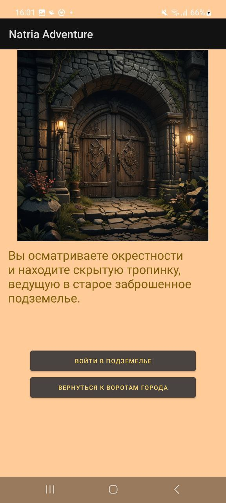
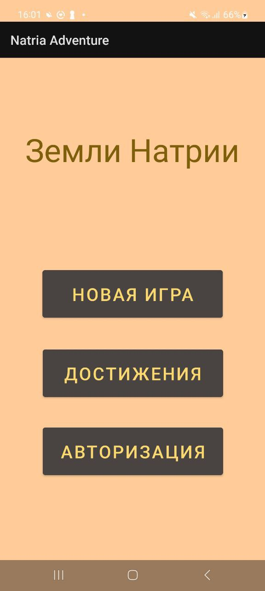

# Natria Adventure 🗡️

*Текстовая ролевая игра на Kotlin с нелинейным сюжетом.*

## 📜 О проекте

**Natria Adventure** — это короткая текстовая ролевая игра (RPG) с увлекательным сюжетом, разработанная на языке **Kotlin**. Этот проект был создан как упражнение в изучении Kotlin и основ разработки мобильных приложений.

## 🌟 Особенности

*   **Интерактивная история:** Ваши выборы напрямую влияют на развитие сюжета и концовку игры.
*   **Простой геймплей:** Классическая механика текстовой RPG, интуитивно понятная каждому.
*   **Система дотижений:** За действия в игре получай достижения, которые сохранятся на сервере.
*   **Система аккаунтов:** Создай аккаутн, чтобы не потерять прогресс достижений.
*   **Разработано на Kotlin:** Проект является демонстрацией возможностей языка для создания интерактивных мобильных приложений.

## 🎯 Цели проекта

При создании Natria Adventure я ставил перед собой следующие цели:

*   Углубленное изучение языка программирования **Kotlin**.
*   Получение практического опыта в разработке мобильных приложений.
*   Реализация интерактивных элементов и игровой логики.

## Как это выглядит?
<a href="5434068146060391974.jpg">
  
</a>
  
  
## 🚀 Как запустить

Для того чтобы запустить проект локально, следуйте этим шагам:

1.  **Клонируйте репозиторий:**
    ```bash
    git clone https://github.com/ShuzzyFer/NatriaAdventure.git
    ```

2.  **Откройте проект:**
    Откройте проект в вашей любимой IDE, например, **Android Studio** или **IntelliJ IDEA**.

3.  **Сборка и запуск:**
    Соберите проект и запустите его на эмуляторе или физическом устройстве.

## 🛠️ Технологии

*   **Язык:** Kotlin
*   **Платформа:** Android
